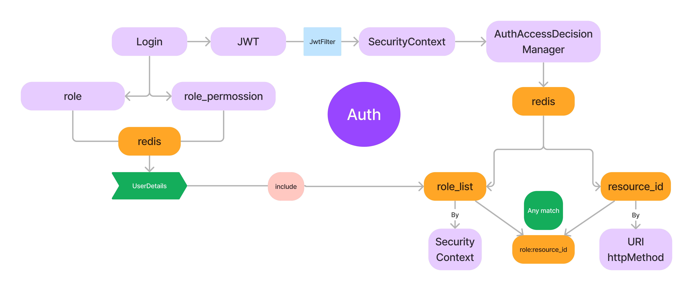

## 创作不易！请给我点个star吧~

## 联系方式见GitHub主页

# EasyAuth

前后端分离项目开发脚手架，拥有完善的权限管理模块，接口级别权限管理粒度。
拥有完善的Api文档，通过本脚手架，能够快速构建自己的项目。

## 技术栈

    SpringBoot
    Mybatis
    Redis
    JWT
    SpringSecurity
    Swagger
    Lombok
    Mysql
    Maven
    EMail

## 项目结构

    com.easuauth
    ├── common -- 通用模块
    ├── config -- 配置类
    ├── constant -- 常量类
    ├── controller -- 控制器
    ├── domain -- 数据类
    ├── handler -- 异常处理
    ├── mapper -- mybatis映射
    ├── service -- 服务
    ├── security -- 安全模块

## 功能模块

```markdown
1. 用户模块
2. 员工模块
3. 角色模块
4. 权限模块
5. 资源模块
6. 邮件模块
```

## 项目启动

1. 克隆项目到本地，通过maven导入项目
2. 数据库：
   导入database目录下的easy_auth.sql文件到Mysql,导入redis.csv到redis（推荐使用工具[Tiny Rdm](https://github.com/tiny-craft/tiny-rdm)）
3. 必须修改`application.yml`中的Mysql,redis,邮件配置
4. 运行`EasyAuthApplication`启动项目

## API文档

访问`http://localhost:{端口}/doc.html`查看API文档

## 注意事项

1. token失效：
   设置了通信延迟设置一个Error_Time来提供容错在`com.easyauth.common.constant.NumberConstant`
2. 用户权限：
   普通用户注册后默认分配权限为4（普通用户），如需修改或修改了role表的相应数据，请在`com.easyauth.controller.user.AuthController`
   中修改
3. 注意配置信息的修改，在`application.yml`中`application-dev.yml`，如需要可再创建
4. 如果出现本地发送邮件失败或十分缓慢,可以在发信代码前加入下面代码（一般服务器上不存在此问题）：
   ```
   // 解决本地DNS未配置 ip->域名场景下，邮件发送太慢的问题  
   System.getProperties().setProperty("mail.mime.address.usecanonicalhostname", "false");  
   // 获取 MimeMessageMimeMessage mimeMessage = mailSender.createMimeMessage();  
   Session session = mimeMessage.getSession();  
   // 设置 日志打印控制器  
   session.setDebug(true);  
   // 解决本地DNS未配置 ip->域名场景下，邮件发送太慢的问题
   session.getProperties().setProperty("mail.smtp.localhost", "test");
   ```
5. 本项目未使用任何数据库外键约束，添加角色，资源，权限时最好通过已经写好的方法进行！修改数据库前确保已经理解相应逻辑！

## API设计

符合RESTFUL规范，使用HTTP请求方法来实现对资源的操作。
不使用路径参数，改为使用查询参数来实现对资源的操作。
便于基于URL的权限认证

## 动态权限

### 实现思路

使用RBAC模型来实现权限控制，RBAC模型是基于角色的权限控制模型，通过对角色的控制来实现对用户的权限控制。

基于数据库来实现动态权限的功能， 通过对数据库的操作来实现对用户的权限控制，可以动态的对用户的权限进行增删改查操作。

由于权限的变化并不频繁，所以可以将权限信息缓存到redis中，这样可以减少对数据库的访问，提高系统的性能。

### 相关Mysql表

- 用户表 user
- 员工表 employee
- 角色表 role
- 用户角色关联表 user_role
- 员工角色关联表 employee_role
- 资源表 resource
- 角色权限关联表 role_permission

### 模型图



### 逻辑步骤

1. 通过spring security的自定义jwt过滤器来实现对用户的认证，将解析token后的信息存入SecurityContext
2. 将用户的授权交给自定义的AuthorizationManager（根据当前请求的URL和http_method从redis中查询所需要的权限，再根据SecurityContext和所需要的权限从redis查询是否匹配）

### JWT

员工的`identity`为`employee`,用户的`identity`为`user`

```json
{
  "identity": "user",
  "id": "1"
}
```

### redis相关实现

由于权限相关数据不会频繁变动，所以可以将权限信息缓存到redis中，并且默认不设置过期时间，在更新权限时刷新相应缓存

1. 用户权限信息(UserDetail)

说明：jwt解析后存出SecurityContext，根据SecurityContext向redis查询

(identity:id)`key`: `user:125`

`value`: `序列化后的JSON字符串`

JSON:

```json
{
  "id": 1,
  "username": "admin",
  "email": "123456@qq.com",
  "rolesId": [
    1,
    2
  ]
}
```

2. 资源权限信息(资源id)

(http_method:URI)
`key`: `GET:/admin/user`

(resource_id)
`value`: `8`

3. 权限匹配验证(1->有权限, 0->无权限)

(roleId:resource_id)`key`: `8:1`

(true `or` false)`value`: `true`

### token刷新

当需要重置token时，颁发新的token前，刷新redis数据，重新设置过期时间，保持redis数据过期时间==jwt的过期时间
只要二者不一致就可以判断token过期（考虑通信延迟设置一个Error_Time来提供容错）