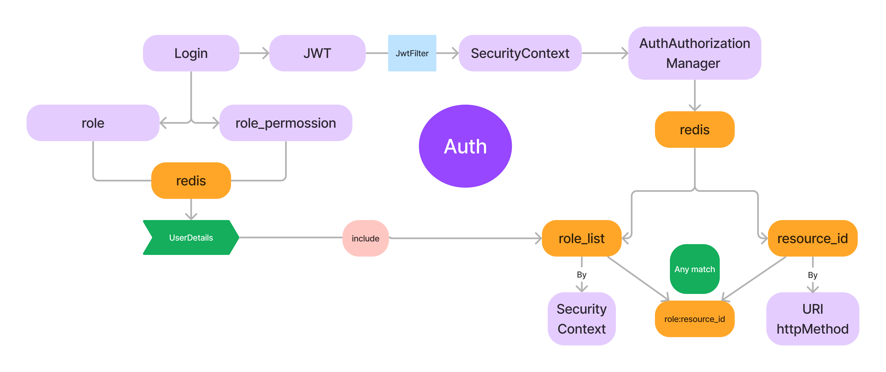

## API
符合RESTFUL规范，使用HTTP请求方法来实现对资源的操作。
不使用路径参数，改为使用查询参数来实现对资源的操作。
便于基于URL的权限认证

## 动态权限

### 实现思路
使用RBAC模型来实现权限控制，RBAC模型是基于角色的权限控制模型，通过对角色的控制来实现对用户的权限控制。

基于数据库来实现动态权限的功能， 通过对数据库的操作来实现对用户的权限控制，可以动态的对用户的权限进行增删改查操作。

由于权限的变化并不频繁，所以可以将权限信息缓存到redis中，这样可以减少对数据库的访问，提高系统的性能。

### 相关表

- 用户表 user
- 员工表 employee
- 角色表 role
- 用户角色关联表 user_role
- 员工角色关联表 employee_role
- 资源表 resource
- 角色权限关联表 role_permission

### 模型图

### 认证
1. 查询user或employee表，获取基本信息
2. 查询user_role或employee_role表，获取角色信息
3. 查询role_permission表，获取权限信息
4. 将权限信息缓存到redis中，通过jwt的token来实现权限的认证

### 授权
1. 通过URL和http_method查询资源表，获取资源信息
2. 将资源的权限信息缓存到redis中，使用http_method:URI作为key，资源ID作为value

### 逻辑步骤
1.通过spring security的自定义jwt过滤器来实现对用户的认证，解析jwt再从redis查询权限信息
2.根据当前请求的URL和http_method再从redis中查询所需要的权限
3.根据用户的权限和所需要的权限进行对比，判断用户是否有权限访问该资源

